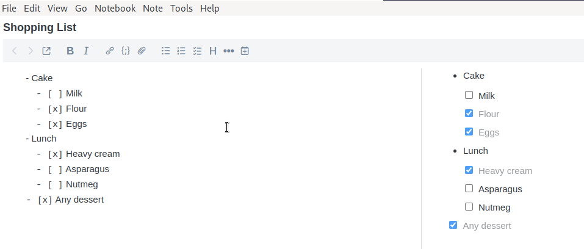

# Joplin Reset Checkboxes

A plugin to reset checkboxes in notes.

<!-- TOC -->
* [Joplin Git Sync Plugin](#joplin-git-sync-plugin)
    * [Installation](#installation)
    * [Usage](#usage)
<!-- TOC -->

## Installation
- Clone project
- `npm run dist`
- Copy created jpl file from dist/ directory to plugins directory in your profile.

## Usage
- Open a file with checkboxes.
- Click Tools > Reset Checkboxes and see your checkboxes reset.
- Although it's tested, there may be unexpected consequences on the off chance. If it happens, open Note Properties on
  the upper right of the editor go to history.